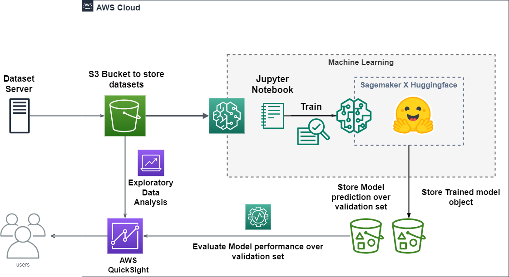
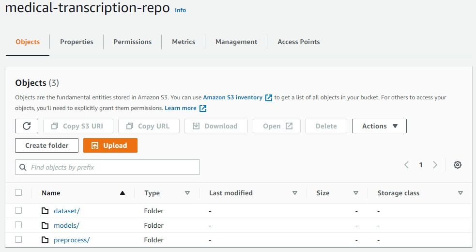
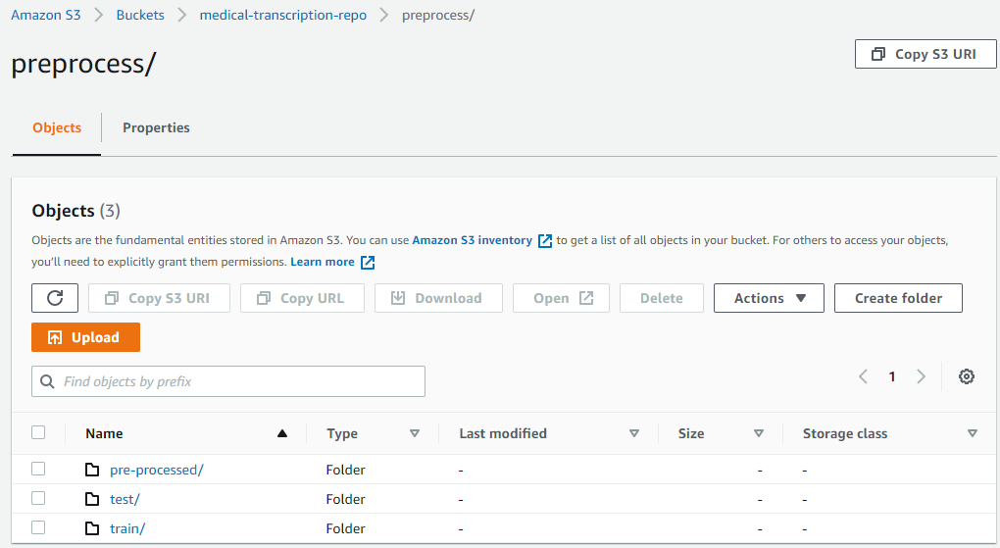
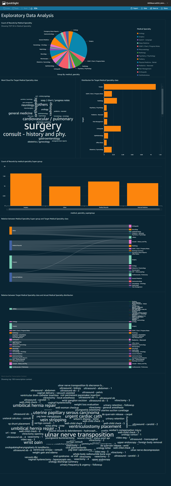
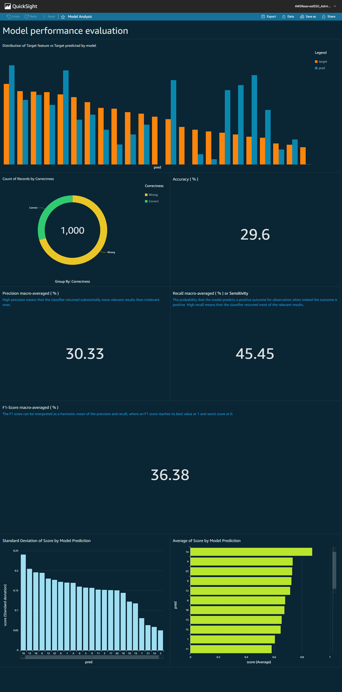

# Architecture to host QuickSight Dashboard for HuggingFace model monitoring deployed on SageMaker along with data EDA
<br>

# Introduction

This is a solution that demonstrates how to train and deploy a pre-trained Huggingface model on AWS SageMaker and publish an AWS QuickSight Dashboard that visualizes the model performance over the validation dataset and Exploratory Data Analysis for the pre-processed training dataset. With this as the architecture for the proposing solution, we try to solve the classification of medical transcripts through Machine Learning, which is basically solving a Bio-medical NLP problem. In this solution, we also discuss feature engineering and handling imbalanced datasets through class weights while training by writing a custom Huggingface trainer in PyTorch.<br>
The significance of using Huggingface with SageMaker is to simplify the training of the transformer-based model on SageMaker and make them easy to deploy for production. Also, using QuickSight Dashboard brings Data and Model Analysis under one roof, making things easier to monitor and configure. The proposed pipeline for dashboarding comes really handy when the project requires a server-side dashboard to monitor the model and data by the administrator or the developer team.

# Technologies used

* AWS SageMaker - To train and deploy pre-trained tranformer models for production.
* transformer - Transformers provides APIs to easily download and train state-of-the-art pretrained models. Using pretrained models can reduce your compute costs, carbon footprint, and save you time from training a model from scratch.
* AWS QuickSight - Quicksight is a cloud-native, serverless BI service provided by AWS.
* AWS S3 - To store datasets and models.

# Video Demonstration
Below is a demo video of the proposed architecture.

[](https://youtu.be/RhTSnn41cnM)

# Problem Statement
Diagnostics prediction aims to automatically predict diagnostics needed for a patient with certain anamnesis.

The anamnesis is represented by a raw text file with the doctor's notes about the patient, including his/her age, complaints described on a freeway, the patient's history and so on. It is unstructured - different sections of one patient's anamnesis may be absent in another's.

The target labels are represented by the name of the needed diagnostics procedure.
The value of the solution might be found in helping a doctor to find the optimal solution for diagnostics order. The patient can save time and money, and the doctor can serve a patient more efficiently by sparing time for unnecessary diagnostics. Moreover, in difficult cases, the algorithm may help a doctor to find a diagnosis faster, which in some cases may be extremely valuable, up to saving lives.

Theoretically, some regularities found by the algorithm may help medical researchers to find the idea of treating some diseases, based on their unobvious interconnections with some symptoms.

# Dataset and Storage
All the datasets are stored in an S3 bucket (medical-transcription-repo)within the dataset directory. This dataset contains sample medical transcriptions for various medical specialities.

The pre-processed and feature engineered datasets are stored in the same S3 bucket at a different directory(*s3://medical-transcription-repo/preprocess/*). The same goes for model storage also (*s3://medical-transcription-repo/models/*).

<br>

Similarly within the preprocess s3 bucket directory we store the training data and validation datasets for further usage.
<br>

```sh
- dataset
    - dataset.csv
- preprocess
    - pre-processed
        - eval
            - validation.csv
        -pre-processed.csv
    - train
        - dataset-info.json
    -test
        - dataset-infor.json
- models
    - huggingface-dd-mm-yyyy:hh-mm-ss
        - output
            - model.tar.gz
            - output.tar.gz
```
## Dataset Source
[Medical transcription](https://www.kaggle.com/datasets/tboyle10/medicaltranscriptions) data scraped from mtsamples.com. This dataset offers a solution by providing medical transcription samples.

# ML Model Training, Deploy and Inference
## AWS SageMaker
To train and deploy the model on SageMaker the following services have been used:
* notebook instances ( `ml.t2.medium` )
* Training jobs( `ml.p3.2xlarge` )
* Inference Endpoint ( `ml.t2.medium` )

## Pre-Processing and Feature Engineering

The original dataset consists of 40 classes to be classified, but some sets of the classes were removed due to a lack of enough training examples w.r.t those classes, finally ending up with a 23 class classification problem. The pre-processed dataset is then uploaded to the s3 bucket for further creating an EDA dashboard in **AWS QuickSight**.

Next, the dataset is split into training and validation sets and tokenised the text data. The pre-trained `distilbert-base-uncased` tokenizer is used to tokenize the input data.

```python
from transformers import AutoTokenizer
# tokenizer used in preprocessing
tokenizer_name = 'distilbert-base-uncased'
# download tokenizer
tokenizer = AutoTokenizer.from_pretrained(tokenizer_name)
# tokenizer helper function
def tokenize(batch):
    return tokenizer(batch['text'],padding=True, truncation=True)
# tokenize dataset
train_dataset = dataset['train'].map(tokenize, batched=True)
test_dataset = dataset['test'].map(tokenize, batched=True)
# set format for pytorch
train_dataset =  train_dataset.rename_column("target", "labels")
train_dataset.set_format('torch', columns=['input_ids', 'attention_mask', 'labels'])
test_dataset = test_dataset.rename_column("target", "labels")
test_dataset.set_format('torch', columns=['input_ids', 'attention_mask', 'labels'])
```
The tokenized training and validation sets are uploaded to the s3 bucket.

```python
import botocore
from datasets.filesystems import S3FileSystem
s3 = S3FileSystem()  
prefix = 'preprocess'
# save train_dataset to s3
training_input_path = f's3://{bucket}/{prefix}/train'
train_dataset.save_to_disk(training_input_path,fs=s3)
# save test_dataset to s3
test_input_path = f's3://{bucket}/{prefix}/test'
test_dataset.save_to_disk(test_input_path,fs=s3)
```
## Estimating class weights
For class imbalance, one aspect to consider is that each batch has enough signal to provide some coverage of all the classes, even the unbalanced ones. Otherwise, it may degenerate during training.

We use class weights to handle an imbalanced dataset, in this case.
```python
from sklearn.utils import class_weight
class_weights = dict(enumerate(class_weight.compute_class_weight('balanced',
               classes=np.unique(df['target']),
               y=df['target'])))
```
## Huggingface custom Trainer
A pre-trained `distilbert-base-uncased` model and custom loss function to handle imbalanced dataset is used for model training.

```python
from transformers import Trainer, TrainingArguments, AutoTokenizer
# create Trainer instance
# Subclass Trainer and override the compute_loss method
class MedModelTrainer(Trainer):
    def compute_loss(self, model, inputs, return_outputs=False):
        labels = inputs.get("labels")
        # forward pass
        outputs = model(**inputs)
        logits = outputs.get("logits")
        # compute custom loss
        loss_fct = torch.nn.CrossEntropyLoss(weight=torch.tensor(list(class_weights.values())))
        loss = loss_fct(logits.view(-1, self.model.config.num_labels), labels.view(-1))
        return (loss, outputs) if return_outputs else loss
trainer = MedModelTrainer(
    model=model,
    args=training_args,
    compute_metrics=compute_metrics,
    train_dataset=train_dataset,
    eval_dataset=test_dataset,
    tokenizer=tokenizer,
)
# train model
trainer.train()
```

## Creating an Estimator and starting a training job
Hugging Face Deep DLCs( Deep Learning Containers ) make it easier than ever to train Transformer models in SageMaker. The following are some of the reasons why you should use Hugging Face DLCs to train and deploy your next machine learning model:
* One command is all you need.
* Accelerate the transition of machine learning from research to production.
* Built-in performance.

In a SageMaker training environment, this estimator executes a Hugging Face training script.

Using the pre-built Hugging Face Docker container, the estimator starts the SageMaker-managed Hugging Face environment and executes the Hugging Face training script provided by the user via the `entry_point` argument.

```python
from sagemaker.huggingface import HuggingFace, TrainingCompilerConfig
# initialize the Amazon Training Compiler
compiler_config=TrainingCompilerConfig()
# hyperparameters, which are passed into the training job
hyperparameters={'epochs': 10,
                 'train_batch_size': 64,
                 'eval_batch_size': 32,
                 'learning_rate': 3e-5, 
                 'model_name':'distilbert-base-uncased'
                 }
huggingface_estimator = HuggingFace(entry_point='train.py',
                            source_dir='./scripts',
                            instance_type='ml.p3.2xlarge',
                            instance_count=1,
                            role=role,
                            transformers_version='4.11.0',
                            pytorch_version='1.9.0',
                            py_version='py38', output_path='s3://{}/models'.format(bucket),
                            hyperparameters = hyperparameters,
                            compiler_config = compiler_config
                                   )
```
Starting the training job with our uploaded datasets as input.
```python
huggingface_estimator.fit({'train': training_input_path, 'test': test_input_path})
```
## Deploying the endpoint
To deploy our endpoint, we call `deploy()` on our HuggingFace estimator object, passing in our desired number of instances and instance type.
```python
predictor = huggingface_estimator.deploy(1,"ml.t2.medium")
```
For inference, you can use your trained Hugging Face model or one of the pre-trained Hugging Face models to deploy an inference job with SageMaker. With this collaboration, you only need one line of code to deploy both your trained models and pre-trained models with SageMaker.
```python
eval_df = pd.read_csv('test.csv')
eval_df['pred'] = 0
eval_df['score'] = 0.0
max_length = 512
for i in range(len(eval_df)):
    sentiment_input= {"inputs": eval_df['text'].iloc[i][:max_length]}
    eval_df['pred'][i] = int(predictor.predict(sentiment_input)[0]['label'].split('_')[1])
    eval_df['score'][i] = float(predictor.predict(sentiment_input)[0]['score'])
```
The validation set with model prediction is stored in the s3 bucket to develop a model performance dashboard on AWS QuickSight.
```python
eval_df.to_csv("model-performance.csv", index=False)
s3 = boto3.resource('s3')
s3.meta.client.upload_file('model-performance.csv', bucket, 'preprocess/pre-processed/eval/model-performance.csv')
```
# AWS QuickSight

Quicksight is a cloud-native, serverless BI service provided by AWS.

The EDA dashboard is visualised over pre-processed medical transcript data. The analysis focuses on the distribution of medical speciality, their subgroups, the relation between them, word cloud for transcription context etc.
<br>

The Model Performance dashboard is visualised for model prediction over the validation medical transcription dataset. The analysis focuses on the correctness of Model prediction; the difference between the distribution of target class and predicted class; Accuracy, Precision, Recall and f1-score of the model over validation set etc.

<br>

## The calculated field for Correctness Graph
```sh
ifelse(pred=target, "Correct", "Wrong")
```
## The calculated field for Accuracy ( % )
```sh
(countIf(Correctness, Correctness="Correct")/ count(Correctness)) * 100
```
## The calculated field for Precision ( % )
```sh
((countIf(pred, pred=0 AND target=0)/countIf(pred, pred=0) +
countIf(pred, pred=1 AND target=1)/countIf(pred, pred=1) +
countIf(pred, pred=2 AND target=2)/countIf(pred, pred=2) +
countIf(pred, pred=3 AND target=3)/countIf(pred, pred=3) +
countIf(pred, pred=4 AND target=4)/countIf(pred, pred=4) +
countIf(pred, pred=5 AND target=5)/countIf(pred, pred=5) +
countIf(pred, pred=6 AND target=6)/countIf(pred, pred=6) +
countIf(pred, pred=7 AND target=7)/countIf(pred, pred=7) +
countIf(pred, pred=8 AND target=8)/countIf(pred, pred=8) +
countIf(pred, pred=9 AND target=9)/countIf(pred, pred=9) +
countIf(pred, pred=10 AND target=10)/countIf(pred, pred=10) +
countIf(pred, pred=11 AND target=11)/countIf(pred, pred=11) +
countIf(pred, pred=11 AND target=11)/countIf(pred, pred=11) +
countIf(pred, pred=12 AND target=12)/countIf(pred, pred=12) +
countIf(pred, pred=13 AND target=13)/countIf(pred, pred=13) +
countIf(pred, pred=14 AND target=14)/countIf(pred, pred=14) +
countIf(pred, pred=15 AND target=15)/countIf(pred, pred=15) +
countIf(pred, pred=16 AND target=16)/countIf(pred, pred=16) +
countIf(pred, pred=17 AND target=17)/countIf(pred, pred=17) +
countIf(pred, pred=18 AND target=18)/countIf(pred, pred=18) +
countIf(pred, pred=19 AND target=19)/countIf(pred, pred=19) +
countIf(pred, pred=20 AND target=20)/countIf(pred, pred=20) +
countIf(pred, pred=21 AND target=21)/countIf(pred, pred=21) +
countIf(pred, pred=22 AND target=22)/countIf(pred, pred=22)) /23) *100
```
## The calculated field for Recall ( % )
```sh
((countIf(pred, pred=0 AND target=0)/countIf(target, target=0) +
countIf(pred, pred=1 AND target=1)/countIf(target, target=1) +
countIf(pred, pred=2 AND target=2)/countIf(target, target=2) +
countIf(pred, pred=3 AND target=3)/countIf(target, target=3) +
countIf(pred, pred=4 AND target=4)/countIf(target, target=4) +
countIf(pred, pred=5 AND target=5)/countIf(target, target=5) +
countIf(pred, pred=6 AND target=6)/countIf(target, target=6) +
countIf(pred, pred=7 AND target=7)/countIf(target, target=7) +
countIf(pred, pred=8 AND target=8)/countIf(target, target=8) +
countIf(pred, pred=9 AND target=9)/countIf(target, target=9) +
countIf(pred, pred=10 AND target=10)/countIf(target, target=10) +
countIf(pred, pred=11 AND target=11)/countIf(target, target=11) +
countIf(pred, pred=11 AND target=11)/countIf(target, target=11) +
countIf(pred, pred=12 AND target=12)/countIf(target, target=12) +
countIf(pred, pred=13 AND target=13)/countIf(target, target=13) +
countIf(pred, pred=14 AND target=14)/countIf(target, target=14) +
countIf(pred, pred=15 AND target=15)/countIf(target, target=15) +
countIf(pred, pred=16 AND target=16)/countIf(target, target=16) +
countIf(pred, pred=17 AND target=17)/countIf(target, target=17) +
countIf(pred, pred=18 AND target=18)/countIf(target, target=18) +
countIf(pred, pred=19 AND target=19)/countIf(target, target=19) +
countIf(pred, pred=20 AND target=20)/countIf(target, target=20) +
countIf(pred, pred=21 AND target=21)/countIf(target, target=21) +
countIf(pred, pred=22 AND target=22)/countIf(target, target=22)) /23) *100
```
## The calculated field for f1-score ( % )
```sh
2 * (Precision*Recall ) / (Precision + Recall)
```
# Conclusion
The proposed AWS cloud architecture provides a solution to train and deploy transformer-based NLP pre-trained models available at Huggingface for production via AWS SageMaker. AWS QuickSight is used to publish dashboards to visualize EDA for the base dataset and ML model performance over the validation set, which successfully brings analysis of data and model under one roof.

# Scopes of Improvements
* The Model performance dashboard could be improved to add precision and recall scores of each class.
* Adding confusion matrix to the Model performance Dashboard.
* Training the model for higher epochs to converge well.
* Trying different pre-trained models like `Bert` and `RoBerta` for better model performance.
* Improving feature engineering techniques like reducing target classes or using **Minority Oversampling** techniques for better performance.

# Reference
* [Hugging Face on Amazon SageMaker](https://huggingface.co/docs/sagemaker/main)
* [Use Hugging Face with Amazon SageMaker](https://docs.aws.amazon.com/sagemaker/latest/dg/hugging-face.html)
* [Oversampling SMOTE and ADASYN](https://www.kaggle.com/code/ruzarx/oversampling-smote-and-adasyn)
* [Clinical Text Classification](https://www.kaggle.com/code/ritheshsreenivasan/clinical-text-classification)